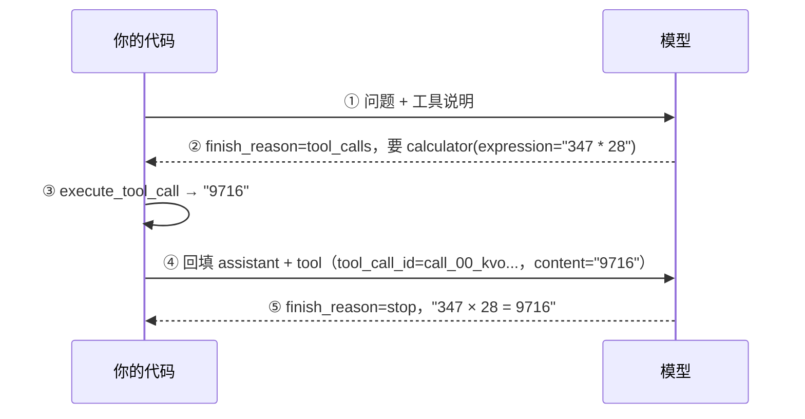

# Day 17：工具调用的完整回合

一次工具调用长什么样、每一步谁在执行——这份文件是 2026-10-09 那次真实运行的记录，
工具是计算器。面试时讲工具调用，讲的就是这张图里的东西。

## 一、这次运行的事实

| 项 | 值 |
|---|---|
| 日期 | 2026-10-09 |
| 模型 | deepseek-flash |
| 问题 | 帮我算一下 347 × 28 等于多少？ |
| 模型点的工具 | `calculator` |
| `tool_calls[0].id` | `call_00_kvoDFHAWTUyriI6T38k35384` |
| `arguments`（是字符串，不是 dict） | `{"expression": "347 * 28"}` |
| 本地执行结果 | `9716` |
| 模型的最终回答 | `347 × 28 = **9716**`，后面附了计算过程：`347 × 20 + 347 × 8 = 6940 + 2776 = 9716` |
| 两轮的 token 账 | 未记录（原因和补法见文末「两点说明」） |

## 二、流程图

```
你的代码                                          模型
   │
   │ ① 发 user 消息：「帮我算一下 347 × 28 等于多少？」
   │    （tools 里带着 build_tools() 写的工具说明）
   ├──────────────────────────────────────────────▶
   │
   │ ② finish_reason = "tool_calls"，content = ""
   │    tool_calls = [{ id: call_00_kvoDFHAWTUyriI6T38k35384,
   │                    name: "calculator",
   │                    arguments: '{"expression": "347 * 28"}' }]
   ◀──────────────────────────────────────────────┤
   │
   │ ③ 本地执行（在你这台机器上，不在模型那边）：
   │    json.loads(arguments) → {"expression": "347 * 28"}
   │    execute_tool_call(...) → "9716"
   │
   │ ④ 回填两条消息，再发一次：
   │      assistant：原样放回（带着 tool_calls 和那个 id）
   │      tool：tool_call_id = call_00_kvoDFHAWTUyriI6T38k35384
   │            content = "9716"
   ├──────────────────────────────────────────────▶
   │
   │ ⑤ finish_reason = "stop"
   │    content = "347 × 28 = **9716**（计算过程：……）"
   ◀──────────────────────────────────────────────┤
   │
   ▼ 返回给 main 打印成「它答：……」
```

同一张图的 Mermaid 版本（GitHub 上能直接渲染）：



**谁在执行**：①②⑤ 是「代码发请求 / 模型回话」，③④ 全在代码这一侧——③ 执行工具函数，
④ 拼回填消息。③ 和 ④ 是两件事，别看成一步。

## 三、结论与原因

**1. 哪几步是模型在动，哪几步是代码在动**
发请求（①④）、执行工具（③）都是代码；点单（②）和最后作答（⑤）是模型。
换句话说：**模型只负责「说要做什么」和「拿到结果后怎么说」，动手的始终是代码。**

**2. 第一次请求的 content 是空的，但不算失败**
第一轮的 `content` 就是空字符串。判断依据是 `finish_reason`：它是 `"tool_calls"`
就说明模型正在点单，正文为空很正常（它这一轮不打算说话，只想调工具）。

**3. 为什么 assistant 那条必须原样放回去**
模型是无状态的，它靠 `tool_calls[].id` 认出「这条工具结果是回答我哪一次点单的」。
所以那条 assistant 消息必须带着完整的 `tool_calls` 一起发回去（id 就住在里面），
下面 `role: "tool"` 那条的 `tool_call_id` 也要写同一个 id。

**4. 不需要工具的那个问题，只走了一步**
「你好，你是谁？」没有产生任何点单轨迹，一次请求就答完了。
这说明在默认的 `auto` 档下，**这一轮要不要用工具是模型判断的**；
而你的代码管的是另外两件事——这一轮给它看哪些工具，以及它点了单之后执不执行。

**5. description 写短了会怎样**
这次写的是：「计算一个数学算式，支持 + - * / 和括号。需要做算术时用它。」
我估计只写四个字（比如「算数学」）它也能选对——核心功能没有少，而且工具名
（`calculator`）、参数名（`expression`）本身也在提示它。
（Day 17 的加餐里六轮实测的第 ③④ 轮就是这种情况：描述被改坏、名字还在，它照样选对。）

## 四、留给明天的问题

- 模型如果工具调用错了怎么办？

## 五、两点说明

**token 账为什么空着**：`ask_with_tools` 只把 `message` 拿回来了，没带 `usage`，
所以练习这条路径打印不出 token 数。要补的话有两条路：跑一次
`day17_tool_calling_demo.py --live`（它会打印两轮的输入/输出 token），
或者自己给 `chat_with_tools` 加一个「把 `response.usage` 也带回来」的出口。

**这张图要能默画**：计划表写着 Day 21 白板默画、第 11 周面试反复用。
练法是合上这份文件，在纸上画两列 + 五个箭头，嘴里念每一步谁在执行；
念不顺的地方就是还没真懂的地方。
