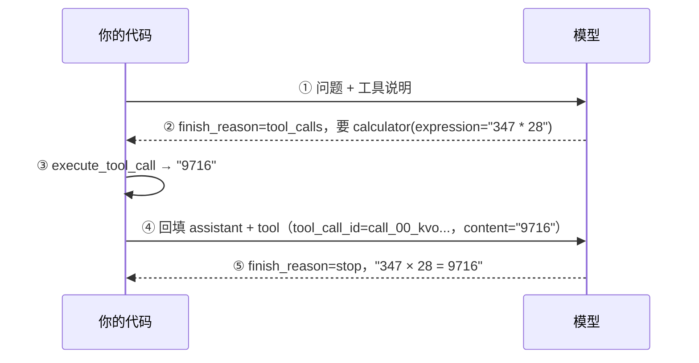

# Day 17 交付物：工具调用的完整流程图

> 这是**学员填**的文件。AI 只留了小标题和引导问题，图和数据都由你画、你贴。
> 计划表里写着「**今天的图不要省**」——第 11 周面试时你会反复用它讲项目。
> 别对着演示抄，凭你自己跑出来的那一轮画。

## 一、先记下这次运行的事实（画图前先有数据）

| 项 | 值 |
|---|---|
| 日期 | 2026-10-09 |
| 模型 | deepseek-flash（`.env` 里的 `LLM_MODEL`） |
| 我问的问题 | 帮我算一下 347 × 28 等于多少？ |
| 模型点的工具名 | `calculator` |
| `tool_calls[0].id`（原样抄） | `call_00_kvoDFHAWTUyriI6T38k35384` |
| `arguments` 原文（注意它是字符串） | `{"expression": "347 * 28"}` |
| 我本地执行的结果 | `9716` |
| 回填后模型的最终回答（原文） | `347 × 28 = **9716**` ＋「计算过程：347 × 28 = 347 × 20 + 347 × 8 = 6940 + 2776 = 9716」 |
| 两轮的 token 账（输入/输出） | **未记录**——练习这条路径没打印 usage（见下面那条说明） |

> **token 账那格怎么补**：`ask_with_tools` 只把 message 拿回来了，没带 usage。
> 最快的两条路：① 跑一次演示脚本的 `--live`，它会把两轮的输入/输出 token 打出来
> （`day17_tool_calling_demo.py --live`）；② 自己往 `chat_with_tools` 里加个
> 「把 `response.usage` 也带回来」的出口。选哪条都行，把数字和来源注明就行。

## 二、流程图（主体）

要求：**每一步都标清「谁在执行」**——模型，还是你的代码。用你顺手的画法：
文字箭头、表格、Mermaid（GitHub 上能直接渲染）都行；手画拍照贴进来也可以。


**画法**：这类「谁和谁来回说话」的图，最省事的是**两列 + 箭头**（面试白板上就这么画）。
下面这份是拿你那次 `--live` 的真实数据填的——五步，每步都标了谁在动。

> 面试前要能**不看这份文件**把它默画出来（计划表：Day 21 白板默画，第 11 周反复用）。
> 练法是：合上文件，在纸上画两列 + 五个箭头，嘴里念每一步谁在执行。

```
你的代码                                          模型
   │
   │ ① 发 user 消息：「帮我算一下 347 × 28 等于多少？」
   │    （tools 里带着 build_tools() 写的工具说明）
   ├──────────────────────────────────────────────▶
   │
   │ ② finish_reason = "tool_calls"，content = ""
   │    tool_calls = [{ id: call_00_kvoDFHAWTUyriI6T38k35384,
   │                    name: "calculator",
   │                    arguments: '{"expression": "347 * 28"}' }]
   ◀──────────────────────────────────────────────┤
   │
   │ ③ 本地执行（在你这台机器上，不在模型那边）：
   │    json.loads(arguments) → {"expression": "347 * 28"}
   │    execute_tool_call(...) → "9716"
   │
   │ ④ 回填两条消息，再发一次：
   │      assistant：原样放回（带着 tool_calls 和那个 id）
   │      tool：tool_call_id = call_00_kvoDFHAWTUyriI6T38k35384
   │            content = "9716"
   ├──────────────────────────────────────────────▶
   │
   │ ⑤ finish_reason = "stop"
   │    content = "347 × 28 = **9716**（计算过程：……）"
   ◀──────────────────────────────────────────────┤
   │
   ▼ 返回给 main 打印成「它答：……」
```

**谁在执行**：①②⑤ 是「代码发请求 / 模型回话」；③④ 全在你的代码里——③ 执行工具，
④ 拼回填消息。注意 ③ 和 ④ 是**两件事**（原先那份把它们合成了「一步」）。

想用 Mermaid 的话（GitHub 上能直接渲染），等价写法是：



## 三、图上的数据要贴真货

把第一部分那几个真实值贴到流程图的对应位置上（尤其是 `tool_call_id` 和
`arguments` 的原文）——面试讲的时候，「这一步传的是字符串」这种细节最能体现
你真跑过。

## 四、现象与原因（用自己的话）

1. 整个回合里，哪几步是模型在动、哪几步是你的代码在动？把它们分别列出来。
   第一步和第三步是代码在动，第二步和第四步是模型在动
2. 第一次请求的 `content` 是什么？为什么它能是空的却不算失败？判断依据是哪个字段？
   content 可能是空的（第一轮就是空字符串），只要 finish_reason = "tool_calls" 就不算失败
3. 为什么回填时必须把 assistant 那条**原样**放回去，`tool_call_id` 还要对得上？
   （提示：模型那边是无状态的，它靠什么认出「这条结果是给我哪一次点单的」）
   模型需要依靠id来判断是哪一次调用
4. main 那两条测试问题里的**第二条**——「你好，你是谁？」（这一句不需要工具）——
   走了几步？（提示：你的输出里如果一条 `[第 N 轮] 它点了 …` 都没有，就是一次都没点单。）
   这说明「这一轮要不要用工具」是谁决定的？
   只走了一步，要不要用工具是模型决定的
5. 你这份 `description` 是怎么写的？如果把它改得只有四个字（比如「算数学」），
   你估计模型还会不会正确点单？为什么？
   计算一个数学算式，支持 + - * / 和括号。需要做算术时用它
   模型应该也会正确点单，因为核心功能没有少，而且模型还会根据参数，工具名等综合考量
## 五、留给明天的问题

> 写下一条你现在答不上来、但明天想弄明白的问题。

- 模型如果工具调用错了怎么办
