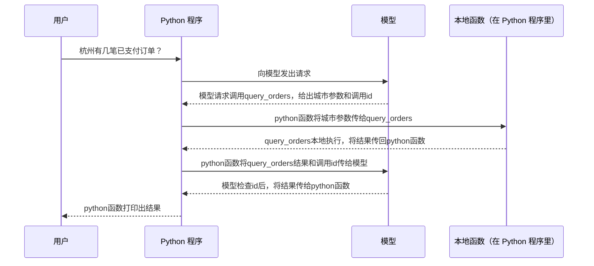
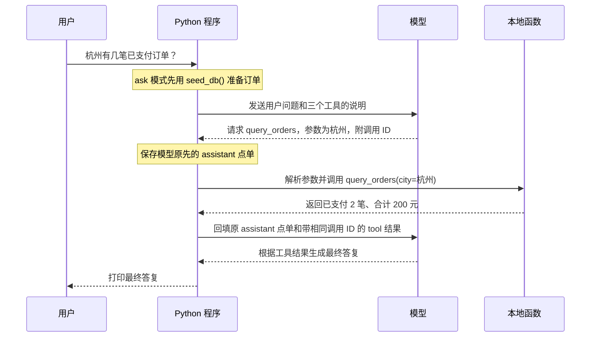

# Day 21｜白板复盘（学员填写）

今天先做闭卷演练，再翻旧记录核对。图和口头回答由你填写；AI 在你完成后批改，并写 Week 02 的交接文档。按你 2026-10-10 的决定，JD 统计和简历修改留到项目结束后统一处理，以下两节保留为届时使用的模板。

> 收尾说明：第一张 Mermaid 图保留学员闭卷原稿；参考图由 AI 提供。学员确认结束时间为 22:29。对照清单和口头答案中的少量准确措辞、标点由 AI 按批改结果校正。

## 1. 五分钟白板：工具调用完整回合

**要做的**：关掉 Day 17 流程图和项目代码，计时 5 分钟。以「杭州有几笔已支付订单？」为例，把下面每个「待填」改成你认为实际发生的事。箭头和人物已经搭好，这次只考你是否理解消息与执行过程。

**期望结果**：别人只看你的图，就能指出哪一步由模型决定、哪一步由 Python 代码执行，以及工具结果怎样与原调用配对。不要照抄旧图；先留下第一次闭卷画的版本。

**提示**：`A->>B` 表示 A 发给 B，`B-->>A` 表示 B 回给 A。`本地函数` 仍是在 Python 程序里运行，不是模型里的函数。也可以在纸上画后拍照。计时结束后才看 `day17_工具调用流程图.md` 和 `info_toolbox/tool_calling.py`。

- 开始时间：2026/10/10 22：25
- 结束时间：2026/10/10 22：29
- 第一次图或照片位置：本节下方第一张 Mermaid 图

对照用的参考图：

### 画完后再对照

逐项核对，缺了就在图旁标注，保留第一次版本：

- [ ] 请求里有用户问题和工具说明；工具说明不是工具执行结果。
- [x] 模型返回工具名、参数和调用 ID；模型没有自己运行 Python 函数。
- [ ] 本地代码解析参数、执行工具；成功和失败都能得到可回填的文字。
- [ ] 原 assistant 点单与带同一调用 ID 的 `tool` 消息都进入下一次请求。
- [ ] 模型可能继续点工具，也可能给最终答复；循环有轮数上限。

- 对照后发现我漏了什么：
- 第一次图没有标出发给模型的工具说明，也没有说明工具失败后怎样回填错误
- 第二次请求还要带回原来的 assistant 工具调用消息
- 调用 ID 是程序回填结果时用来配对的，不能简单说“模型核验 ID”
- 没有说明模型可能继续点工具，也可能给最终答复
- 我用自己的话解释「谁在什么时候执行了什么」：
- 用户先向程序提出问题
- 程序将问题和工具说明交给模型
- 模型返回工具调用请求和调用id，函数参数给程序
- 程序在本地执行函数，把原 assistant 点单和带相同调用 ID 的工具结果回填给模型
- 模型收到工具结果后形成最终回答给程序
- 程序将最终回答打印给用户

## 2. 两道口头题与一条真实故障

每题先不看资料，说 60～90 秒，再把要点写下来；答完才看 `docs/agent面试八股文.md` 的 Q7～Q13 对照，不要照抄。

### 题 A：工具调用陷入死循环，怎么定位和停止？

**要做的**：说出先看哪几条运行轨迹，怎样判断是同一个工具反复报错、参数没有变化，还是模型在换工具；再说程序靠什么停止。

**期望结果**：回答能指向本项目真实代码或 Day 19 的离线自测，而不是只说「加重试」。

**提示**：找 `info_toolbox/tool_calling.py` 的 `ask_with_recovery()`，并回看 `day19_error_recovery_probe.py` 的轮数上限检查。

- 我的回答：先看ask_with_recovery里的输出，看模型每次调用了什么工具，抛出了什么错误。
- 离线自测中，同一错误调用重复两次后，程序因 `max_rounds=2` 停止，并返回「达到最大轮数！」。如果工具或参数在变化，可以检查是否朝正确方向修正；确有需要时，在测试中适当提高轮数上限。

### 题 B：工具设计得好和差，区别在哪？

**要做的**：从工具名称、描述、参数和职责边界各举一个具体点，再用本项目的工具说明举例。

**期望结果**：能解释为什么模糊描述会让模型选错工具，以及本地函数为什么还要验证参数。

**提示**：看 `info_toolbox/tool_calling.py` 的 `build_tools()`；Day 17 的 `day17_tool_choice_demo.py` 和 `day17_parameters_demo.py` 有实际对照。

- 我的回答：工具名称必须正确反映用途，不能简单tool_a这种，描述也需要正确说明工具的作用，参数必须正确，而且要设置那些参数可选哪些必选，职责边界要分清，一个工具就做自己分内的事情。
- 本例中的工具分工就很明确，三个函数互不干扰，工具名称，描述都正确反映工具的用途
- 如 `calculator` 的说明写了支持加减乘除运算、`expression` 参数是必填；参数有错时，本地程序会捕获异常并回填错误类型和文字，供模型纠错。

### 题 C：南京天气那次，第三轮查到北京为什么仍不能回答南京？

**要做的**：解释「工具执行成功」和「结果回答了原问题」的区别，并说出当前程序实际返回了什么。

**期望结果**：不把北京的天气当成南京的天气；能从 Day 20 的逐轮轨迹找到依据。

**提示**：看 `day20_演示与面试素材.md` 的「模拟天气调用」。

- 我的回答：模型查到的是北京的天气，这跟需要的答案并不对应，调用查到北京只说明功能调用成功了，并不能说明成功回答了问题
- 第三轮后程序达到上限并退出，没有再请求模型生成最终回答，因此程序没有把北京的天气作为南京的答案输出。

## 3. 十条招聘 JD 与技能差距（项目结束后处理）

**要做的**：从自己想投的城市和岗位中选 10 条不同的招聘 JD（职位描述），把每条的来源与关键词填入仓库根目录 `jd-keywords.md`；再统计重复关键词。不要把同一家公司同一岗位的转载当成两条。

**期望结果**：`jd-keywords.md` 有 10 条可回看的来源、关键词计数和「我是否会」判断；这里写出你当前最需要补的 1～3 项。

**提示**：搜索词可以从「大模型应用工程师」「Agent 开发工程师」「AI 应用开发」开始，按你的目标城市筛选。只记 JD 原文明确要求的技能，不用猜招聘方的隐藏要求。

- 我选择的城市与岗位范围：杭州，agents开发，ai应用开发
- 这 10 条 JD 里反复出现、我还不会的技能：
- 我准备在哪一周补，为什么：

## 4. 简历新增一行（项目结束后处理）

**要做的**：根据 Week 02 已完成的项目写一条简历项目经历。仓库里没有简历文件，先在这里写草稿，确认真实后再放进你自己的简历。

**期望结果**：一句话说清做了什么、用了什么技术、有什么可核对的证据；不要把模拟天气写成实时天气，也不要把未录的视频写成已录。

**提示**：证据可以来自 `info_toolbox/` 的代码、项目 README 和 Day 20 的真实调用轨迹；数字只写实际记录过的。

- 我的简历句子：
- 这句话的证据在哪：

## 交作业前自查

- [x] 五分钟闭卷图已留下，计时和对照后的漏项已记录。
- [x] 题 A、B、C 都用自己的话回答，并指出代码或运行依据。
- [ ] 项目结束后：`jd-keywords.md` 有 10 条来源与关键词统计。
- [ ] 项目结束后：简历新增一行有真实证据，不夸大项目能力。
